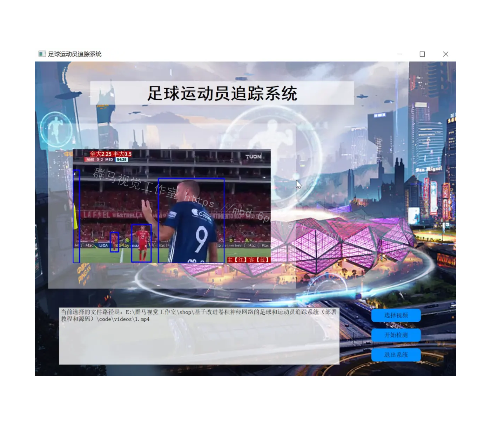
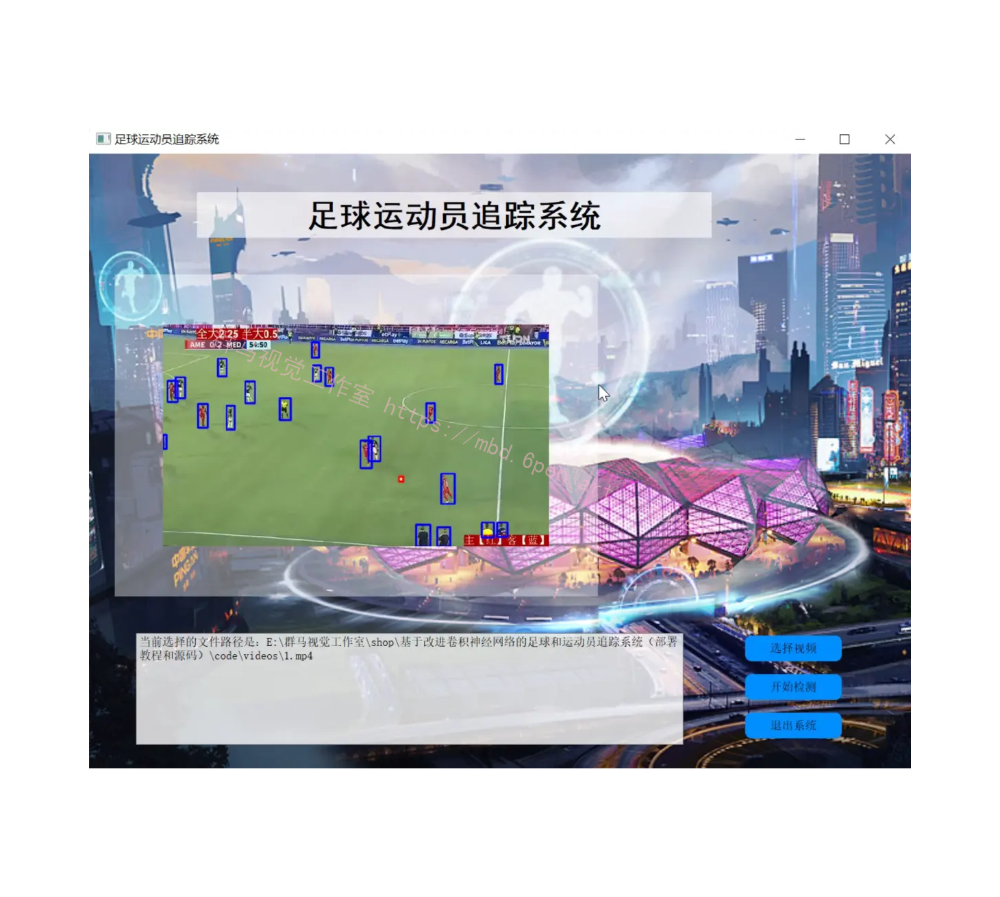
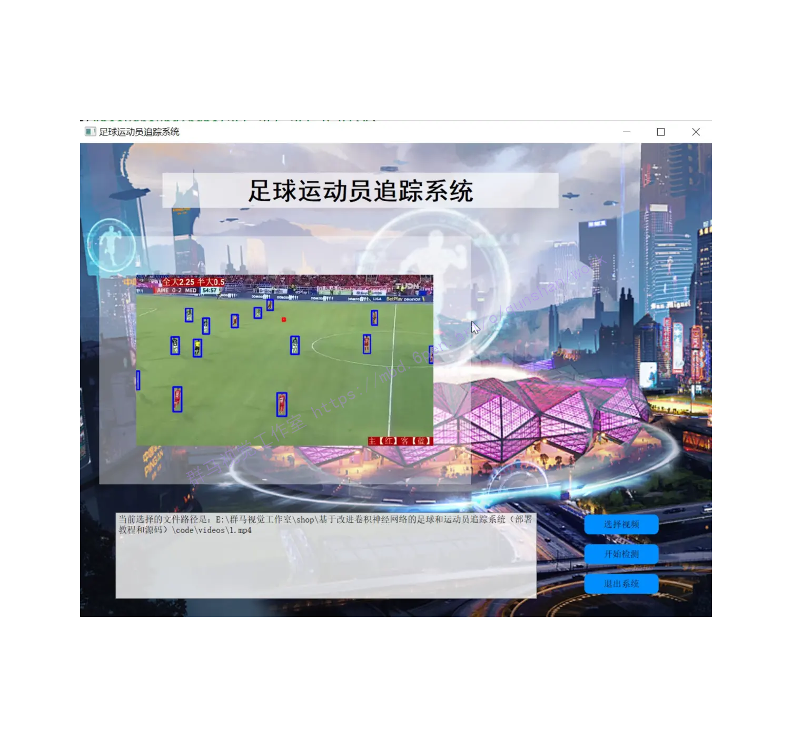
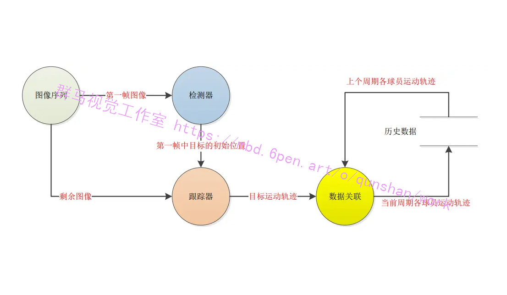
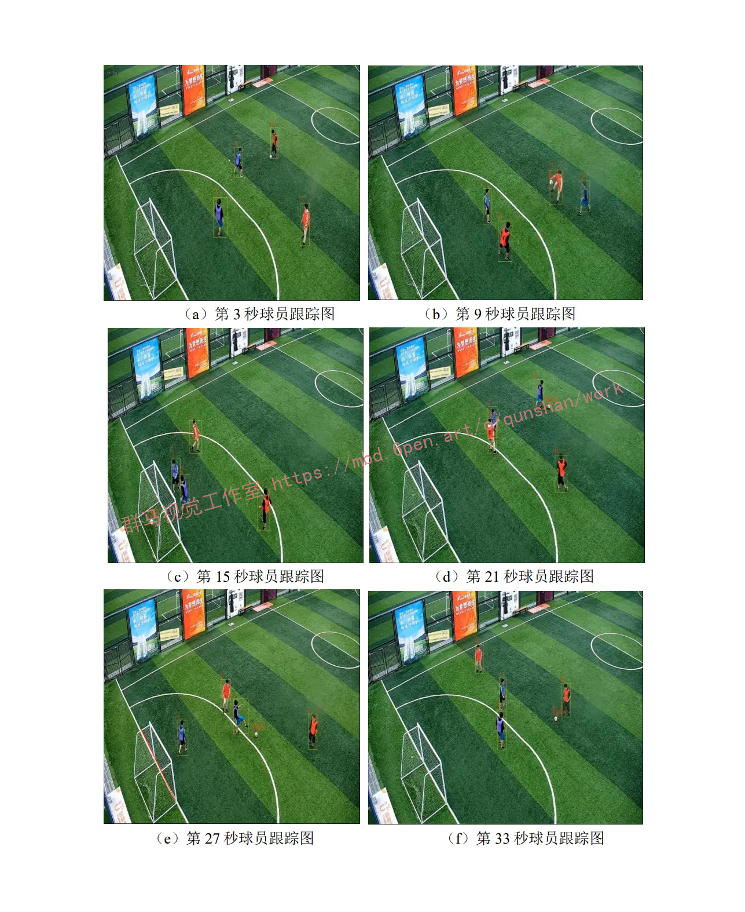
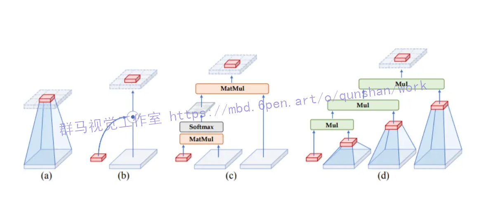
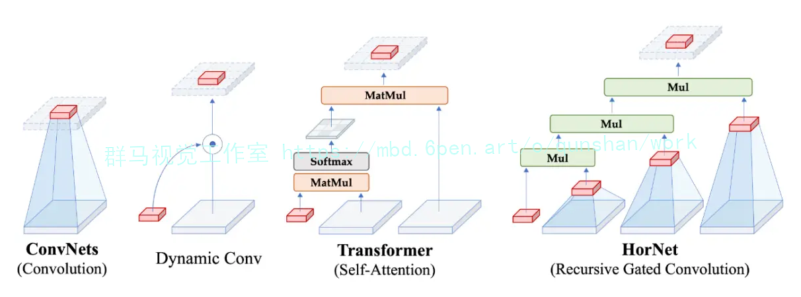
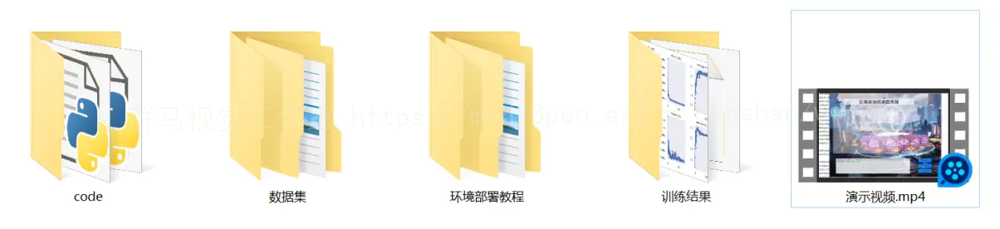



## 1.研究背景与意义


随着计算机视觉和深度学习的快速发展，基于图像和视频的物体追踪技术在各个领域得到了广泛应用。其中，足球和运动员追踪系统在体育竞技中具有重要的意义。传统的追踪方法往往依赖于手工设计的特征和规则，效果受限。而基于深度学习的方法，特别是改进的卷积神经网络（CNN），在目标检测和追踪任务中取得了显著的进展。

足球和运动员追踪系统的研究具有重要的实际意义。首先，对于足球比赛的分析和评估来说，准确追踪球员和球的位置是至关重要的。通过追踪球员的移动轨迹和球的运动轨迹，可以提供更全面的比赛数据，帮助教练和分析师更好地了解比赛的进展和球员的表现。其次，对于球迷来说，能够实时追踪球员和球的位置，可以提供更丰富的观赛体验，增加比赛的趣味性和吸引力。此外，足球和运动员追踪系统还可以应用于视频回放和裁判判罚，提供客观的依据，减少争议。

然而，目前的足球和运动员追踪系统仍然存在一些挑战。首先，由于足球比赛的复杂性和快节奏性，球员之间存在频繁的接触和遮挡，导致追踪算法的准确性和鲁棒性受到影响。其次，传统的追踪方法往往需要大量的人工标注数据和手工设计的特征，不仅耗时耗力，而且泛化能力有限。因此，如何基于改进的卷积神经网络来提高足球和运动员追踪系统的准确性和鲁棒性，成为当前研究的热点和挑战。

本研究旨在基于改进的卷积神经网络，设计和实现一个高效准确的足球和运动员追踪系统，并提供部署教程和源码。具体来说，我们将探索如何利用深度学习技术来提取图像和视频中的特征，并结合目标检测和追踪算法，实现对足球和运动员的准确追踪。我们将采用改进的卷积神经网络结构，如多尺度特征融合、注意力机制和时空建模等，以提高追踪系统的准确性和鲁棒性。

本研究的意义在于提供了一种基于改进的卷积神经网络的足球和运动员追踪系统的解决方案。通过提供部署教程和源码，我们希望能够帮助研究者和开发者更好地理解和应用深度学习技术在足球和运动员追踪领域的优势。此外，我们的研究还可以为足球比赛的分析和评估提供更准确的数据支持，为球迷提供更丰富的观赛体验，同时也可以应用于视频回放和裁判判罚等领域，提供客观的依据。

# 2.图片演示






# 3.视频演示
[基于改进卷积神经网络的足球和运动员追踪系统（部署教程和源码）_哔哩哔哩_bilibili](https://www.bilibili.com/video/BV1Mr4y1R74X/?vd_source=ff015de2d29cbe2a9cdbfa7064407a08)

# 4. 单相机多目标跟踪框架
单相机多目标跟踪器以检测器和单目标跟踪器为基础，首先将整个视频分解为多个跟踪周期，每个跟踪周期包含若干帧连续的图像。在每一个跟踪周期中，第一帧进行检测，接下来的几帧进行跟踪，通过数据关联的方式将相邻的两个跟踪周期的结果融合起来，其结构如图所示。

在每个跟踪周期中，第一帧检测出图像中所有的目标位置，用每个目标的的初始位置初始化跟踪器，在剩余的图片序列中进行一个短时的跟踪，得到每个目标的运动轨迹。下一步就是要将这个图片序列中的所有运动轨迹赋予相应的编号，这是通过数据关联算法来完成的。数据关联算法将上一个周期各个编号目标的运动轨迹与当前周期所有的运动轨迹进行匹配。
这里需要说明的是，在足球场场景中，球员会经常跑出某个相机的视野范围，也就是说会出现目标消失的情况，一般来说需要做重检测的操作，当一个新目标被检测出来时，需要判断它是一个新出现的目标还是一个已经出现过但是在之前消失了的目标。由于足球场场景中的目标极为相似，球员之间的身高，姿态，球衣颜色都有很高的相似度，重检测的难度非常大。所以在单相机多目标跟踪模块中，我们不进行重检测操作，把所有新出现的目标都作为一个新的目标来处理。



## 5.核心代码讲解

#### 5.1 improve.py

封装为类后的代码如下：

```python
import torch.nn as nn
......
class GNConv(nn.Module):
    def __init__(self, dim, order=5, gflayer=None, h=14, w=8, s=1.0):
        super().__init__()
        self.order = order
        self.dims = [dim // 2 ** i for i in range(order)]
        self.dims.reverse()
        self.proj_in = nn.Conv2d(dim, 2 * dim, 1)

        if gflayer is None:
            self.dwconv = get_dwconv(sum(self.dims), 7, True)
        else:
            self.dwconv = gflayer(sum(self.dims), h=h, w=w)

        self.proj_out = nn.Conv2d(dim, dim, 1)

        self.pws = nn.ModuleList(
            [nn.Conv2d(self.dims[i], self.dims[i + 1], 1) for i in range(order - 1)]
        )

        self.scale = s
        print('[gnconv]', order, 'order with dims=', self.dims, 'scale=%.4f' % self.scale)
......
```

这个类名为`GNConv`，继承自`nn.Module`。在`__init__`方法中，定义了类的属性和各个层的初始化。其中，`dim`表示输入特征的通道数，`order`表示GNConv的阶数，`gflayer`表示自定义的层（如果没有则使用默认的`get_dwconv`方法），`h`和`w`表示输入特征的高度和宽度，`s`表示缩放因子。

在类的初始化过程中，首先计算了`dims`列表，用于存储每个阶数对应的通道数。然后使用`nn.Conv2d`初始化了`proj_in`、`dwconv`和`proj_out`三个卷积层。接着使用`nn.ModuleList`初始化了`pws`列表，其中每个元素都是一个`nn.Conv2d`层。

最后，打印了一条初始化信息。

注意：上述代码中的`get_dwconv`方法没有给出，需要根据实际情况进行定义。

该程序文件名为improve.py，代码主要定义了一个名为gnconv的类。该类继承自nn.Module，用于实现一个改进的卷积操作。

在类的初始化方法中，接收了一些参数，包括dim（输入通道数）、order（卷积的阶数，默认为5）、gflayer（用于生成gflayer的函数，默认为None）、h（输入特征图的高度，默认为14）、w（输入特征图的宽度，默认为8）、s（缩放因子，默认为1.0）。

在初始化方法中，首先根据输入通道数dim计算出每一阶的通道数，然后通过nn.Conv2d定义了一个输入通道数为dim，输出通道数为2 * dim的卷积层self.proj_in。

接下来根据gflayer是否为None来选择不同的卷积层self.dwconv。如果gflayer为None，则通过get_dwconv函数生成一个卷积层，输入通道数为所有阶的通道数之和，卷积核大小为7，使用深度可分离卷积。如果gflayer不为None，则通过gflayer函数生成一个卷积层，输入通道数为所有阶的通道数之和，高度为h，宽度为w。

然后通过nn.Conv2d定义了一个输入通道数为dim，输出通道数为dim的卷积层self.proj_out。

最后通过nn.ModuleList定义了一个包含order-1个卷积层的列表self.pws，每个卷积层的输入通道数为第i阶的通道数，输出通道数为第i+1阶的通道数。

最后打印了一条信息，包括order的值、dims的值和scale的值。

整个程序文件的作用是定义了一个改进的卷积操作gnconv，其中包含了多个卷积层和一些参数。

#### 5.2 Interface.py

```python

class YOLOv5Detector:
    def __init__(self, weights, data, device='', half=False, dnn=False):
        self.weights = weights
        self.data = data
        self.device = device
        self.half = half
        self.dnn = dnn
        self.model = None
        self.stride = None
        self.names = None
        self.pt = None
        self.jit = None
        self.onnx = None
        self.engine = None

    def load_model(self):
        # Load model
        device = select_device(self.device)
        self.model = DetectMultiBackend(self.weights, device=device, dnn=self.dnn, data=self.data)
        self.stride, self.names, self.pt, self.jit, self.onnx, self.engine = (
            self.model.stride, self.model.names, self.model.pt, self.model.jit, self.model.onnx, self.model.engine
        )

        # Half
        half = self.half and (self.pt or self.jit or self.onnx or self.engine) and device.type != 'cpu'
        if self.pt or self.jit:
            self.model.model.half() if half else self.model.model.float()

    def run(self, img, imgsz=(640, 640), conf_thres=0.25, iou_thres=0.45, max_det=1000, classes=None,
            agnostic_nms=False, augment=False):
        cal_detect = []

        device = select_device(self.device)
        names = self.model.module.names if hasattr(self.model, 'module') else self.model.names  # get class names

        # Set Dataloader
        im = letterbox(img, imgsz, self.stride, self.pt)[0]

        # Convert
        im = im.transpose((2, 0, 1))[::-1]  # HWC to CHW, BGR to RGB
        im = np.ascontiguousarray(im)

        im = torch.from_numpy(im).to(device)
        im = im.half() if self.half else im.float()  # uint8 to fp16/32
        im /= 255  # 0 - 255 to 0.0 - 1.0
        if len(im.shape) == 3:
            im = im[None]  # expand for batch dim

        pred = self.model(im, augment=augment)

        pred = non_max_suppression(pred, conf_thres, iou_thres, classes, agnostic_nms, max_det=max_det)
        # Process detections
        for i, det in enumerate(pred):  # detections per image
            if len(det):
                # Rescale boxes from img_size to im0 size
                det[:, :4] = scale_coords(im.shape[2:], det[:, :4], img.shape).round()

                # Write results
                for *xyxy, conf, cls in reversed(det):
                    c = int(cls)  # integer class
                    label = f'{names[c]}'
                    cal_detect.append([label, xyxy])
        return cal_detect

```

这个程序文件是一个接口文件，主要用于加载模型并进行目标检测。程序首先导入了所需的库和模块，然后定义了一些常量和全局变量。接下来，程序定义了一个`load_model`函数，用于加载模型和设置相关参数。然后，程序定义了一个`run`函数，用于运行目标检测算法并返回检测结果。最后，程序定义了一个`detect`函数，用于读取图像并调用`run`函数进行目标检测，然后将检测结果绘制在图像上并显示出来。整个程序的主要功能就是加载模型并进行目标检测。

#### 5.3 torch_utils.py

```python

@contextmanager
def torch_distributed_zero_first(local_rank: int):
    """
    Decorator to make all processes in distributed training wait for each local_master to do something.
    """
    if local_rank not in [-1, 0]:
        dist.barrier(device_ids=[local_rank])
    yield
    if local_rank == 0:
        dist.barrier(device_ids=[0])


def date_modified(path=__file__):
    # return human-readable file modification date, i.e. '2021-3-26'
    t = datetime.datetime.fromtimestamp(Path(path).stat().st_mtime)

```
这个程序文件是一个用于PyTorch的工具文件，主要包含了一些常用的函数和类。下面是文件中的一些主要部分：

1. 导入了一些需要使用的库和模块，如torch、torchvision、datetime等。
2. 定义了一个装饰器函数`torch_distributed_zero_first`，用于在分布式训练中让所有进程等待每个本地主进程执行某些操作。
3. 定义了一些辅助函数，如`date_modified`用于返回文件的修改日期，`git_describe`用于返回git描述信息，`select_device`用于选择设备，`time_sync`用于获取准确的时间等。
4. 定义了一个用于分析模型速度、内存和FLOPs的函数`profile`。
5. 定义了一些

#### 5.4 train.py

```python

class Trainer:
    def __init__(self, hyp, opt, device, tb_writer=None):
        self.hyp = hyp
        self.opt = opt
        self.device = device
        self.tb_writer = tb_writer
        self.logger = logging.getLogger(__name__)
        self.save_dir = Path(opt.save_dir)
        self.epochs = opt.epochs
        self.batch_size = opt.batch_size
        self.total_batch_size = opt.total_batch_size
        self.weights = opt.weights
        self.rank = opt.global_rank
        self.freeze = opt.freeze
        self.wdir = self.save_dir / 'weights'
        self.wdir.mkdir(parents=True, exist_ok=True)  # make dir
        self.last = self.wdir / 'last.pt'
        self.best = self.wdir / 'best.pt'
        self.results_file = self.save_dir / 'results.txt'
        self.plots = not opt.evolve  # create plots
        self.cuda = device.type != 'cpu'
        self.init_seeds(2 + self.rank)
        with open(opt.data) as f:
            self.data_dict = yaml.load(f, Loader=yaml.SafeLoader)  # data dict
        self.is_coco = opt.data.endswith('coco.yaml')
        self.loggers = {'wandb': None}  # loggers dict
        if self.rank in [-1, 0]:
            self.opt.hyp = self.hyp  # add hyperparameters
            run_id = torch.load(self.weights, map_location=self.device).get('wandb_id') if self.weights.endswith('.pt') and os.path.isfile(self.weights) else None
            wandb_logger = WandbLogger(self.opt, Path(self.opt.save_dir).stem, run_id, self.data_dict)
            self.loggers['wandb'] = wandb_logger.wandb
            self.data_dict = wandb_logger.data_dict
            if wandb_logger.wandb:
                self.weights, self.epochs, self.hyp = self.opt.weights, self.opt.epochs, self.opt.hyp  # WandbLogger might update weights, epochs if resuming
        self.nc = 1 if self.opt.single_cls else int(self.data_dict['nc'])  # number of classes
        self.names = ['item'] if self.opt.single_cls and len(self.data_dict['names']) != 1 else self.data_dict['names']  # class names
        assert len(self.names) == self.nc, '%g names found for nc=%g dataset in %s' % (len(self.names), self.nc, self.opt.data)  # check
        self.pretrained = self.weights.endswith('.pt')
        if self.pretrained:
            with torch_distributed_zero_first(self.rank):
                attempt_download(self.weights)  # download if not found locally
            ckpt = torch.load(self.weights, map_location=self.device)  # load checkpoint
            self.model = Model(self.opt.cfg or ckpt['model'].yaml, ch=3, nc=self.nc, anchors=self.hyp.get('anchors')).to(self.device)  # create
            exclude = ['anchor'] if (self.opt.cfg or self.hyp.get('anchors')) and not self.opt.resume else []  # exclude keys
            state_dict = ckpt['model'].float().state_dict()  # to FP32
            state_dict = intersect_dicts(state_dict, self.model.state_dict(), exclude=exclude)  # intersect
            self.model.load_state_dict(state_dict, strict=False)  # load
            self.logger.info('Transferred %g/%g items from %s' % (len(state_dict), len(self.model.state_dict()), self.weights))  # report
        else:
            self.model = Model(self.opt.cfg, ch=3, nc=self.nc, anchors=self.hyp.get('anchors')).to(self.device)  # create
        with torch_distributed_zero_first(self.rank):
            check_dataset(self.data_dict)  # check
        self.train_path = self.data_dict['train']
        self.test_path = self.data_dict['val']
        self.freeze = [f'model.{x}.' for x in (self.freeze if len(self.freeze) > 1 else range(self.freeze[0]))]  # parameter names to freeze (full or partial)
        for k, v in self.model.named_parameters():
            v.requires_grad = True  # train all layers
            if any(x in k for x in self.freeze):
                print('freezing %s' % k)
                v.requires_grad = False
        self.nbs = 64  # nominal batch size
        self.accumulate = max(round(self.nbs / self.total_batch_size), 1)  # accumulate loss before optimizing
        self.hyp['weight_decay'] *= self.total_batch_size * self.accumulate / self.nbs  # scale weight_decay
        self.logger.info(f"Scaled weight_decay = {self.hyp['weight_decay']}")
        self.pg0, self.pg1, self.pg2 = [], [], []  # optimizer parameter groups
        for k, v in self.model.named_modules():
            if hasattr(v, 'bias') and isinstance(v.bias, nn.Parameter):
                self.pg2.append(v.bias)  # biases
            if isinstance(v, nn.BatchNorm2d):
                self.pg0.append(v.weight)  # no decay
            elif hasattr(v, 'weight') and isinstance(v.weight, nn.Parameter):
                self.pg1.append(v.weight)  # apply decay
            if hasattr(v, 'im'):
                if hasattr(v.im, 'implicit'):           
                    self.pg0.append(v.im.implicit)
                else:
                    for iv in v.im:
                        self.pg0.append(iv.implicit)
            if hasattr(v, 'imc'):
                if hasattr(v.imc, 'implicit'):           
                    self.pg0.append(v.imc.implicit)
                else:
                    for iv in v.imc:
                        self.pg0.append(iv.implicit)
            if hasattr(v, 'imb'):
                if hasattr(v.imb, 'implicit'):           
                    self.pg0.append(v.imb.implicit)
                else:
                    for iv in v.imb:
                        self.pg0.append(iv.implicit)
            if hasattr(v, 'imo'):
                if hasattr(v.imo, 'implicit'):           
                    self
```
这个程序文件是一个用于训练模型的脚本。它导入了一些必要的库和模块，包括argparse、logging、torch等。它定义了一个train函数，该函数接受一些超参数、选项和设备信息，并进行模型训练。在训练过程中，它会加载预训练模型（如果有的话），设置优化器和学习率调度器，冻结一些参数，创建数据加载器，进行模型训练和评估等操作。最后，它会保存训练结果和日志信息。

#### 5.5 ui.py

```python

class YOLOv5Detector:
    def __init__(self):
        self.model, self.stride, self.names, self.pt, self.jit, self.onnx, self.engine = self.load_model()

    def load_model(self,
            weights=ROOT / 'best.pt',  # model.pt path(s)
            data=ROOT / 'data/coco128.yaml',  # dataset.yaml path
            device='',  # cuda device, i.e. 0 or 0,1,2,3 or cpu
            half=False,  # use FP16 half-precision inference
            dnn=False,  # use OpenCV DNN for ONNX inference
    ):
        # Load model
        device = select_device(device)
        model = DetectMultiBackend(weights, device=device, dnn=dnn, data=data)
        stride, names, pt, jit, onnx, engine = model.stride, model.names, model.pt, model.jit, model.onnx, model.engine

        # Half
        half &= (pt or jit or onnx or engine) and device.type != 'cpu'  # FP16 supported on limited backends with CUDA
        if pt or jit:
            model.model.half() if half else model.model.float()
        return model, stride, names, pt, jit, onnx, engine

    def detect(self, img, imgsz=(640, 640), conf_thres=0.05, iou_thres=0.15, max_det=1000, device='', classes=None, agnostic_nms=False, augment=False, half=False):
        cal_detect = []

        device = select_device(device)
        names = self.model.module.names if hasattr(self.model, 'module') else self.model.names  # get class names

        # Set Dataloader
        im = letterbox(img, imgsz, self.stride, self.pt)[0]

        # Convert
        im = im.transpose((2, 0, 1))[::-1]  # HWC to CHW, BGR to RGB
        im = np.ascontiguousarray(im)

        im = torch.from_numpy(im).to(device)
        im = im.half() if half else im.float()  # uint8 to fp16/32
        im /= 255  # 0 - 255 to 0.0 - 1.0
        if len(im.shape) == 3:
            im = im[None]  # expand for batch dim

        pred = self.model(im, augment=augment)

        pred = non_max_suppression(pred, conf_thres, iou_thres, classes, agnostic_nms, max_det=max_det)
        # Process detections
        for i, det in enumerate(pred):  # detections per image
            if len(det):
                # Rescale boxes from img_size to im0 size
                det[:, :4] = scale_coords(im.shape[2:], det[:, :4], img.shape).round()

                # Write results

                for *xyxy, conf, cls in reversed(det):
                    c = int(cls)  # integer class
                    label = f'{names[c]}'
                    lbl = names[int(cls)]
                    cal_detect.append([label, xyxy,float(conf)])
        return cal_detect


class Ui_MainWindow(object):
    def setupUi(self, MainWindow):
        MainWindow.setObjectName("MainWindow")
        MainWindow.resize(1280, 960)
        MainWindow.setStyleSheet("background-image: url(\"./template/carui.png\")")
        self.centralwidget = QtWidgets.QWidget(MainWindow)
        self.centralwidget.setObjectName("centralwidget")
        self.label = QtWidgets.QLabel(self.centralwidget)
        self.label.setGeometry(QtCore.QRect(168, 60, 800, 71))
        self.label.setAutoFillBackground(False)
        self.label.setStyleSheet("")
        self.label.setFrameShadow(QtWidgets.QFrame.Plain)
        self.label.setAlignment(QtCore.Qt.AlignCenter)
        self.label.setObjectName("label")
        self.label.setStyleSheet("font-size:50px;font-weight:bold;font-family:SimHei;background:rgba(255,255,255,0);")
        self.label_2 = QtWidgets.QLabel(self.centralwidget)
       
```
这个程序文件是一个基于PyQt5的图形用户界面(GUI)程序，用于实现足球运动员追踪系统。程序主要包括以下几个部分：

1. 导入所需的模块和库，包括argparse、platform、shutil、time、numpy、cv2、torch等。
2. 定义了一个load_model函数，用于加载模型。
3. 定义了一个run函数，用于运行模型进行目标检测。
4. 定义了一个det_yolov7函数，用于读取视频文件并进行目标检测。
5. 定义了一个Thread_1类，继承自QThread，用于创建一个线程来执行目标检测。
6. 定义了一个Ui_MainWindow类，用于创建主窗口和界面布局。
7. 在if __name__ == "__main__"中，加载模型并创建一个Qt应用程序，创建主窗口并显示。

该程序主要实现了以下功能：
- 加载模型并进行目标检测。
- 通过选择视频文件进行目标检测。
- 显示检测结果和视频画面。
- 提供开始检测和退出系统的按钮。

注意：该程序依赖于其他模块和库，需要确保这些模块和库已经安装并正确配置。


## 6.系统整体结构

该项目包含了多个程序文件，每个文件负责不同的功能模块。主要包括模型定义、训练、目标检测、图形用户界面等。

下面是每个文件的功能概述：

| 文件路径 | 功能概述 |
| --- | --- |
| improve.py | 定义了一个改进的卷积操作类 |
| Interface.py | 加载模型并进行目标检测的接口文件 |
| torch_utils.py | 包含了一些PyTorch的工具函数和类 |
| train.py | 用于训练模型的脚本 |
| ui.py | 基于PyQt5的图形用户界面(GUI)程序 |
| models\common.py | 定义了一些常用的模块和函数，用于目标检测模型 |
| models\experimental.py | 包含了一些实验性的模型定义 |
| models\tf.py | 包含了一些TensorFlow的模型定义 |
| models\yolo.py | 包含了YOLO模型的定义 |
| models\__init__.py | 模型模块的初始化文件 |
| tools\activations.py | 包含了一些激活函数的定义 |
| tools\augmentations.py | 包含了一些数据增强的函数 |
| tools\autoanchor.py | 包含了自动锚框生成的函数 |
| tools\autobatch.py | 包含了自动批处理的函数 |
| tools\callbacks.py | 包含了一些回调函数的定义 |
| tools\datasets.py | 包含了数据集的定义和处理函数 |
| tools\downloads.py | 包含了下载数据集的函数 |
| tools\general.py | 包含了一些通用的辅助函数 |
| tools\loss.py | 包含了一些损失函数的定义 |
| tools\metrics.py | 包含了一些评估指标的定义 |
| tools\plots.py | 包含了绘图函数的定义 |
| tools\torch_utils.py | 包含了一些PyTorch的辅助函数 |
| tools\__init__.py | 工具模块的初始化文件 |
| tools\aws\resume.py | 包含了AWS上的恢复训练函数 |
| tools\aws\__init__.py | AWS模块的初始化文件 |
| tools\flask_rest_api\example_request.py | 包含了Flask REST API的示例请求 |
| tools\flask_rest_api\restapi.py | 包含了Flask REST API的定义 |
| tools\loggers\__init__.py | 日志记录器模块的初始化文件 |
| tools\loggers\wandb\log_dataset.py | 包含了WandB日志记录器的数据集日志函数 |
| tools\loggers\wandb\sweep.py | 包含了WandB日志记录器的超参数搜索函数 |
| tools\loggers\wandb\wandb_utils.py | 包含了WandB日志记录器的辅助函数 |
| tools\loggers\wandb\__init__.py | WandB日志记录器模块的初始化文件 |
| utils\activations.py | 包含了一些激活函数的定义 |
| utils\augmentations.py | 包含了一些数据增强的函数 |
| utils\autoanchor.py | 包含了自动锚框生成的函数 |
| utils\autobatch.py | 包含了自动批处理的函数 |
| utils\callbacks.py | 包含了一些回调函数的定义 |
| utils\datasets.py | 包含了数据集的定义和处理函数 |
| utils\downloads.py | 包含了下载数据集的函数 |
| utils\general.py | 包含了一些通用的辅助函数 |
| utils\loss.py | 包含了一些损失函数的定义 |
| utils\metrics.py | 包含了一些评估指标的定义 |
| utils\plots.py | 包含了绘图函数的定义 |
| utils\torch_utils.py | 包含了一些PyTorch的辅助函数 |
| utils\__init__.py | 工具模块的初始化文件 |
| utils\aws\resume.py | 包含了AWS上的恢复训练函数 |
| utils\aws\__init__.py | AWS模块的初始化文件 |
| utils\flask_rest_api\example_request.py | 包含了Flask REST API的示例请求 |
| utils\flask_rest_api\restapi.py | 包含了Flask REST API的定义 |
| utils\loggers\__init__.py | 日志记录器模块的初始化文件 |
| utils\loggers\wandb\log_dataset.py | 包含了WandB日志记录器的数据集日志函数 |
| utils\loggers\wandb\sweep.py | 包含了WandB日志记录器的超参数搜索函数 |
| utils\loggers\wandb\wandb_utils.py | 包含了WandB日志记录器的辅助函数 |
| utils\loggers\wandb\__init__.py | WandB日志记录器模块的初始化文件 |

# 7.引入递归门控卷积（gnConv）
参考该大牛博主的博客，作为当前先进的深度学习目标检测一算法YOLOv5，已经集合了大量的trick，但是还是有提高和改进的空间，针对具体应用场景下的检测难点，可以不同的改进方法。此后的系列文章，将重点对YOLOv5的如何改进进行详细的介绍，目的是为了给那些搞工程项目的朋友需要达到更好的效果提供自己的微薄帮助和参考。

YOLOv5主干特征提取网络为CNN网络，CNN具有平移不变性和局部性，缺乏全局建模长距离建模的能力，引入自然语言处理领域的框架Transformer来形成CNN+Transformer架构，充分两者的优点，提高目标检测效果，本人经过实验，对小目标以及密集预测任务会有一定的提升效果。视觉Transformers 的最新进展在基于点积self-attention的新空间建模机制驱动的各种任务中取得了巨大成功。递归门控卷积(gnConv)，它通过门控卷积和递归设计执行高阶空间交互。新操作具有高度的灵活性和可定制性，它兼容各种卷积变体，并将自注意力中的二阶交互扩展到任意阶，而不会引入大量额外的计算。gnConv可以作为一个即插即用的模块来改进各种视觉Transformer和基于卷积的模型。Transformer方法融合参考YOLOv5改进往期。




视觉Transformers的最新进展在各种任务中都取得了巨大的成功由基于点积自注意力的新空间建模机制驱动。在本文中，我们展示了愿景变形金刚背后的关键要素，即输入自适应、长程和高阶空间交互，也可以使用基于卷积的框架有效地实现。我们提出递归门控卷积
(gnConv)，它通过门控卷积和递归设计执行高阶空间交互。新的操作高度灵活可定制，兼容各种卷积变体并将self-attention中的二阶交互扩展到任意阶，而无需引入大量额外的计算。GnConv可以作为即插即用模块来改进各种视觉变压器和基于卷积的模型。基于该操作，我们构建了一个新的通用视觉骨干家族
命名为HorNet。IlmageNel分类、COCO对象的大量实验检测和ADE20K语义分割显示HorNet优于Swin Transformers和ConvNeXt具有相似的整体架构和训练配置。HorNet 还显示出良好的可扩展性更多的训练数据和更大的模型大小。除了视觉编码器的有效性之外，我们还展示了gnConv可以应用于特定任务的解码器和以更少的计算持续提高密集预测性能。我们的结果表明, gnConv可以成为可视化建模的新基础模块它有效地结合了视觉Transformer 和CNN 的优点



# 8.系统整合
下图[完整源码＆环境部署视频教程＆数据集＆自定义UI界面](https://s.xiaocichang.com/s/5832ee)


参考博客[《基于改进卷积神经网络的足球和运动员追踪系统（部署教程和源码）》](https://mbd.pub/o/qunshan/work)

# 9.参考文献
---
[1][黎万义](https://s.wanfangdata.com.cn/paper?q=%E4%BD%9C%E8%80%85:%22%E9%BB%8E%E4%B8%87%E4%B9%89%22),[王鹏](https://s.wanfangdata.com.cn/paper?q=%E4%BD%9C%E8%80%85:%22%E7%8E%8B%E9%B9%8F%22),[乔红](https://s.wanfangdata.com.cn/paper?q=%E4%BD%9C%E8%80%85:%22%E4%B9%94%E7%BA%A2%22).[引入视觉注意机制的目标跟踪方法综述](https://d.wanfangdata.com.cn/periodical/zdhxb201404001)[J].[自动化学报](https://sns.wanfangdata.com.cn/perio/zdhxb).2014,(4).DOI:10.3724/SP.J.1004.2014.00561.

[2][周鑫](https://s.wanfangdata.com.cn/paper?q=%E4%BD%9C%E8%80%85:%22%E5%91%A8%E9%91%AB%22),[钱秋朦](https://s.wanfangdata.com.cn/paper?q=%E4%BD%9C%E8%80%85:%22%E9%92%B1%E7%A7%8B%E6%9C%A6%22),[叶永强](https://s.wanfangdata.com.cn/paper?q=%E4%BD%9C%E8%80%85:%22%E5%8F%B6%E6%B0%B8%E5%BC%BA%22),等.[改进后的TLD视频目标跟踪方法](https://d.wanfangdata.com.cn/periodical/zgtxtxxb-a201309008)[J].[中国图象图形学报](https://sns.wanfangdata.com.cn/perio/zgtxtxxb-a).2013,(9).DOI:10.11834/jig.20130908.

[3][明安龙](https://s.wanfangdata.com.cn/paper?q=%E4%BD%9C%E8%80%85:%22%E6%98%8E%E5%AE%89%E9%BE%99%22),[马华东](https://s.wanfangdata.com.cn/paper?q=%E4%BD%9C%E8%80%85:%22%E9%A9%AC%E5%8D%8E%E4%B8%9C%22).[多摄像机之间基于区域SIFT描述子的目标匹配](https://d.wanfangdata.com.cn/periodical/jsjxb200804011)[J].[计算机学报](https://sns.wanfangdata.com.cn/perio/jsjxb).2008,(4).DOI:10.3321/j.issn:0254-4164.2008.04.011.

[4][代科学](https://s.wanfangdata.com.cn/paper?q=%E4%BD%9C%E8%80%85:%22%E4%BB%A3%E7%A7%91%E5%AD%A6%22),[李国辉](https://s.wanfangdata.com.cn/paper?q=%E4%BD%9C%E8%80%85:%22%E6%9D%8E%E5%9B%BD%E8%BE%89%22),[涂丹](https://s.wanfangdata.com.cn/paper?q=%E4%BD%9C%E8%80%85:%22%E6%B6%82%E4%B8%B9%22),等.[监控视频运动目标检测减背景技术的研究现状和展望](https://d.wanfangdata.com.cn/periodical/zgtxtxxb-a200607002)[J].[中国图象图形学报](https://sns.wanfangdata.com.cn/perio/zgtxtxxb-a).2006,(7).DOI:10.3969/j.issn.1006-8961.2006.07.002.

[5][王爱平](https://s.wanfangdata.com.cn/paper?q=%E4%BD%9C%E8%80%85:%22%E7%8E%8B%E7%88%B1%E5%B9%B3%22).视频目标跟踪技术研究[D].2011.

[6][冈萨雷斯](https://s.wanfangdata.com.cn/paper?q=%E4%BD%9C%E8%80%85:%22%E5%86%88%E8%90%A8%E9%9B%B7%E6%96%AF%22). 数字图像处理 [M].电子工业出版社,2007.

[7][权太范,1949-](https://s.wanfangdata.com.cn/paper?q=%E4%BD%9C%E8%80%85:%22%E6%9D%83%E5%A4%AA%E8%8C%83%2C1949-%22). 目标跟踪新理论与技术 [M].国防工业出版社,2009.

[8][Henriques, Joao F.](https://s.wanfangdata.com.cn/paper?q=%E4%BD%9C%E8%80%85:%22Henriques%2C%20Joao%20F.%22),[Caseiro, Rui](https://s.wanfangdata.com.cn/paper?q=%E4%BD%9C%E8%80%85:%22Caseiro%2C%20Rui%22),[Martins, Pedro](https://s.wanfangdata.com.cn/paper?q=%E4%BD%9C%E8%80%85:%22Martins%2C%20Pedro%22),等.[High-Speed Tracking with Kernelized Correlation Filters](https://d.wanfangdata.com.cn/periodical/c8f7e9e032e4e419c5c79d7a5f1f6494)[J].IEEE Transactions on Pattern Analysis & Machine Intelligence.2015,37(3).

[9][He, Kaiming](https://s.wanfangdata.com.cn/paper?q=%E4%BD%9C%E8%80%85:%22He%2C%20Kaiming%22),[Zhang, Xiangyu](https://s.wanfangdata.com.cn/paper?q=%E4%BD%9C%E8%80%85:%22Zhang%2C%20Xiangyu%22),[Ren, Shaoqing](https://s.wanfangdata.com.cn/paper?q=%E4%BD%9C%E8%80%85:%22Ren%2C%20Shaoqing%22),等.[Spatial Pyramid Pooling in Deep Convolutional Networks for Visual Recognition](https://d.wanfangdata.com.cn/periodical/16af9df1c3639d30f1267053d035032d)[J].IEEE Transactions on Pattern Analysis & Machine Intelligence.2015,37(9).1904-1916.

[10]佚名.[Preserving Structure in Model-Free Tracking](https://d.wanfangdata.com.cn/periodical/a7a934f71a414bf21e74e747ddbe9fad)[J].IEEE Transactions on Pattern Analysis & Machine Intelligence.2014,36(4).


---
#### 如果您需要更详细的【源码和环境部署教程】，除了通过【系统整合】小节的链接获取之外，还可以通过邮箱以下途径获取:
#### 1.请先在GitHub上为该项目点赞（Star），编辑一封邮件，附上点赞的截图、项目的中文描述概述（About）以及您的用途需求，发送到我们的邮箱
#### sharecode@yeah.net
#### 2.我们收到邮件后会定期根据邮件的接收顺序将【完整源码和环境部署教程】发送到您的邮箱。
#### 【免责声明】本文来源于用户投稿，如果侵犯任何第三方的合法权益，可通过邮箱联系删除。